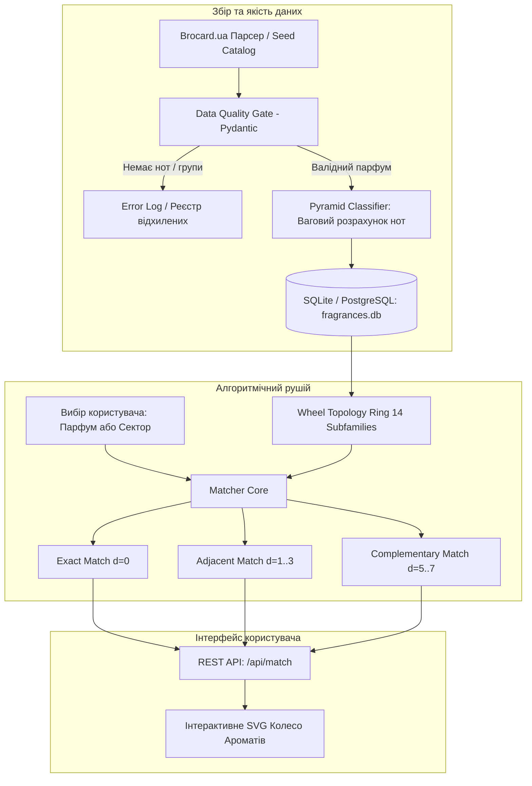

# BRD: Архітектура та бізнес-вимоги системи підбору ароматів (Fragrance Wheel Matcher)

**Проєкт:** Fragrance Wheel Matcher (Ольфакторний рекомендаційний сервіс для клієнтів Brocard)  
**Автор / Архітектор:** Yukhym Shulha  
**Статус:** MVP розроблено, протестовано та готове до демонстрації  
**Технічний стек:** Python 3.14, Starlette (ASGI), SQLite 3 / PostgreSQL 15+, SQLAlchemy, Pydantic, Playwright, Vanilla JS / SVG (Dark Theme)

---

## 1. Бізнес-мета та проблема (Problem Statement)

### Проблема в ритейлі парфумерії:
* **Сліпий вибір та перевантаження (Olfactory Fatigue):** У фізичному магазині клієнт може спробувати максимум 3–4 аромати, після чого нюхові рецептори втомлюються. В онлайні (brocard.ua) вибір ускладнений тим, що текстові описи на кшталт «витончений, чуттєвий аромат» не дають уявлення про реальний характер композиції.
* **Filter Bubble у звичайних рекомендаціях:** Більшість інтернет-магазинів пропонують як «схожі товари» лише інші фланкери того самого бренду або ті самі бестселери, не даючи клієнту персоналізованого відчуття відкриття нового.

### Бізнес-рішення:
Створення інтерактивного ольфакторного консультанта на основі **Колеса Ароматів Майкла Едвардса (14 підгруп у 4 квадрантах)**, який:
1. Дозволяє обрати свій улюблений парфум або акорд на колі.
2. Пропонує три чітко розмежовані сценарії підбору:
   * **Точний збіг (Safe Bet / Exact Match):** прямі аналоги за домінуючим акордом та перекриттям піраміди.
   * **Безпечне відкриття (Safe Discovery / Adjacent Segments):** гармонійні суміжні акорди для тих, хто хоче спробувати щось нове, але боїться розчарування.
   * **Сміливий контраст (Bold Discovery / Complementary Contrasts):** протилежний сектор Колеса для кардинальної зміни настрою та стилю.

---

## 2. Що зроблено (Функціональний огляд)

### 2.1. Топологічна модель Колеса Ароматів ([`wheel_topology.py`](file:///Users/yukhymshulha/Library/Mobile%20Documents/iCloud~md~obsidian/Documents/Slamnom%20notes/fragrance_matcher/core/wheel_topology.py))
Впроваджено класичне Колесо Едвардса з 14 підгрупами, розташованими у фіксованому порядку на кільці:
* **Квіткові (Floral):** `floral_pure` (Квіткові), `floral_soft` (М'які квіткові), `floral_oriental` (Східно-квіткові).
* **Східні (Oriental):** `oriental_soft` (М'які східні), `oriental_pure` (Східні), `oriental_woody` (Деревно-східні).
* **Деревні (Woody):** `woody_pure` (Деревні), `woody_mossy` (Мохові / Шипрові), `woody_dry` (Сухі деревні / Шкіряні).
* **Свіжі (Fresh):** `fresh_citrus` (Цитрусові), `fresh_aquatic` (Водні), `fresh_green` (Зелені), `fresh_fruity` (Фруктові), `fresh_aromatic` (Ароматичні / Фужерні).

### 2.2. Класифікатор нотних пірамід ([`pyramid_classifier.py`](file:///Users/yukhymshulha/Library/Mobile%20Documents/iCloud~md~obsidian/Documents/Slamnom%20notes/fragrance_matcher/core/pyramid_classifier.py))
* Нормалізатор українських та англійських назв понад 100 ключових інгредієнтів.
* Ваговий аналіз трирівневої піраміди Жана Карля:
  * Базові ноти (вага 1.5) — шлейф і фіксація.
  * Ноти серця (вага 1.2) — ядро аромату.
  * Верхні ноти (вага 0.7) — початковий акорд.

### 2.3. Data Quality Gate та пайплайн завантаження ([`ingest.py`](file:///Users/yukhymshulha/Library/Mobile%20Documents/iCloud~md~obsidian/Documents/Slamnom%20notes/fragrance_matcher/pipeline/ingest.py))
* Сувора валідація вхідних даних через Pydantic ([`schemas.py`](file:///Users/yukhymshulha/Library/Mobile%20Documents/iCloud~md~obsidian/Documents/Slamnom%20notes/fragrance_matcher/pipeline/schemas.py)).
* **Автоматичне блокування некоректних даних:** якщо запис не має піраміди або жодна нота не мапиться на Колесо, він відхиляється і не потрапляє в базу даних.
* Ідемпотентний механізм оновлення (запобігає дублюванню товарів).

### 2.4. Сховище даних (SQLite + PostgreSQL DDL)
* **Локальний запуск (Zero-Setup):** База SQLite (`fragrances.db`) створюється автоматично з попередньо заповненими довідниками Колеса та каталогом бестселерів.
* **Продакшн схема PostgreSQL ([`01_postgres_schema.sql`](file:///Users/yukhymshulha/Library/Mobile%20Documents/iCloud~md~obsidian/Documents/Slamnom%20notes/fragrance_matcher/db/01_postgres_schema.sql)):** реляційні таблиці з масивами `TEXT[]`, індексами та підтримкою ідемпотентних запитів `ON CONFLICT DO UPDATE`.

### 2.5. Скрапер каталогу Brocard ([`brocard_scraper.py`](file:///Users/yukhymshulha/Library/Mobile%20Documents/iCloud~md~obsidian/Documents/Slamnom%20notes/fragrance_matcher/scrapers/brocard_scraper.py))
* Браузерний рушій на базі **Playwright** для безпечного проходження захисту Cloudflare Turnstile на сайті `brocard.ua`.
* Парсер текстових описів ольфакторної піраміди («Початкова нота», «Нота серця», «Кінцева нота»).
* Стартовий верифікований набір бестселерів Brocard ([`seed_brocard_catalog.json`](file:///Users/yukhymshulha/Library/Mobile%20Documents/iCloud~md~obsidian/Documents/Slamnom%20notes/fragrance_matcher/data/seed_brocard_catalog.json)): Lancôme, Carolina Herrera, Chanel, Tom Ford, YSL, Dior, Kilian, MFK, Giorgio Armani з цінами та артикулами.

### 2.6. Інтерактивний вебінтерфейс ([`index.html`](file:///Users/yukhymshulha/Library/Mobile%20Documents/iCloud~md~obsidian/Documents/Slamnom%20notes/fragrance_matcher/app/static/index.html))
* Графічне SVG-колесо з 14 радіальними секторами у преміальній темній темі (Dark Minimalist).
* Динамічне підсвічування: активний сектор, суміжні зони (напівпрозоре сяйво) та контрастна зона (штриховий маркер).
* Селектор парфумів Brocard для миттєвого підбору альтернатив під відомий флакон.
* Картки рекомендацій з розгорнутою пірамідою (верх/серце/база), ціною в грн та прямим посиланням на картку товару в Brocard.

---

## 3. Архітектурна діаграма потоку даних

---

## 4. Результати тестування

Проєкт повністю покритий автоматичними тестами:
* `test_wheel.py` — 100% проходження тестів циклічної метрики кільця ($13 \leftrightarrow 0$).
* `test_classifier.py` — успішна перевірка класифікатора пірамід нот.
* `test_pipeline.py` — підтвердження блокування невалідних записів через Data Quality Gate.
* `test_api.py` — перевірка всіх REST-ендпоінтів (`/`, `/api/wheel`, `/api/fragrances`, `/api/match`) через ASGI TestClient.
